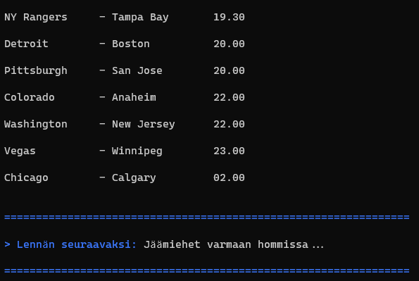
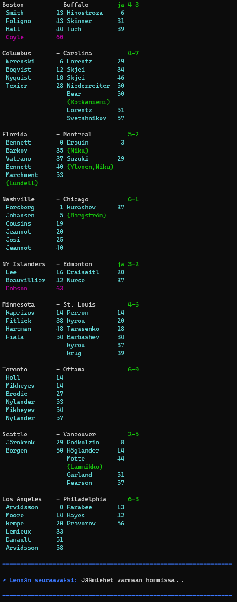

# Tekstitv 235

[Tekstitv 235](https://yle.fi/aihe/tekstitv?P=235)

Randomly gets the next match to watch from the games that are currently on going. Or if no games are on going, praises the icemen that are probably rebuilding the ice, again.

## TODO list

- Refactor out of main.rs into meaningful structures.
- Handle Siir. cases
- Make it testable and add tests

## Sample output

### Output when no games have started yet

> |>cargo run



### Output when some games are on going

> |>cargo run

```text
TODO: update output when next games are available
```

### Output when all the games for the day have finished

> |>cargo run


